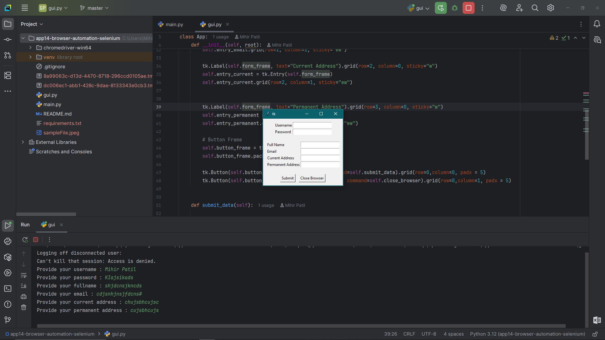

# 🖥️ Browser Web Automation GUI with Tkinter & Selenium

This project is a Python-based desktop GUI application that automates web interactions using Selenium. It features a simple form built with `Tkinter` that lets users input login and personal details. The app also downloads a file via browser automation and provides a button to close the browser when done.

## Screenshot



## Features

- Login automation using Selenium
- Form filling on the web using input from the GUI
- File download triggered from the site
- Simple and responsive GUI using Tkinter
- Graceful browser shutdown with feedback

## Technologies Used

- Python 3.12+
- Selenium WebDriver
- Tkinter (Standard Python GUI library)
- ChromeDriver (ensure it's compatible with your Chrome version)

## Project Structure

```bash
├── chromedriver-win64/
│ └── chromedriver.exe
├── gui.py # Tkinter-based GUI logic
├── main.py # Selenium automation script
├── requirements.txt # Required Python packages
├── README.md # Project documentation
└── venv/ # Virtual environment (optional)
```

## How to Run

1. **Clone the repository**  
```bash
git clone https://github.com/yourusername/browser-web-automation-gui.git
cd browser-web-automation-gui
```
   
2. **Set up virtual environment**
```bash
python -m venv venv
source venv/bin/activate  # or venv\Scripts\activate on Windows
```
3. **Install dependencies**
```bash
pip install -r requirements.txt
```
4. **Run the application**
```bash
python gui.py
```
## Notes
Ensure you have Google Chrome installed.
Update the path to chromedriver.exe if it's located elsewhere.
This app uses DemoQA as the test site for automation tasks.

## License
This project is licensed under the MIT License.

## Made with 💻 Python and 🧪 Selenium
